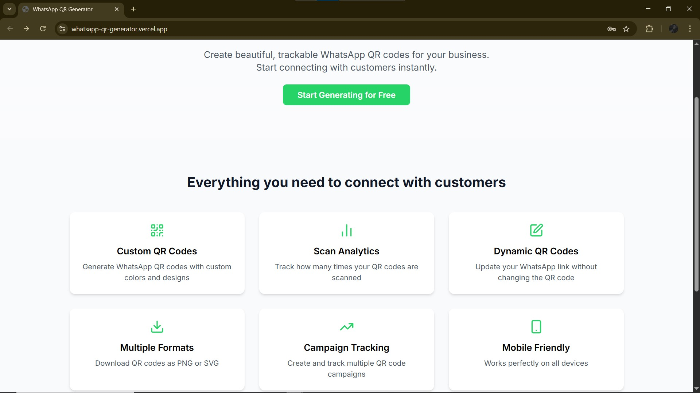
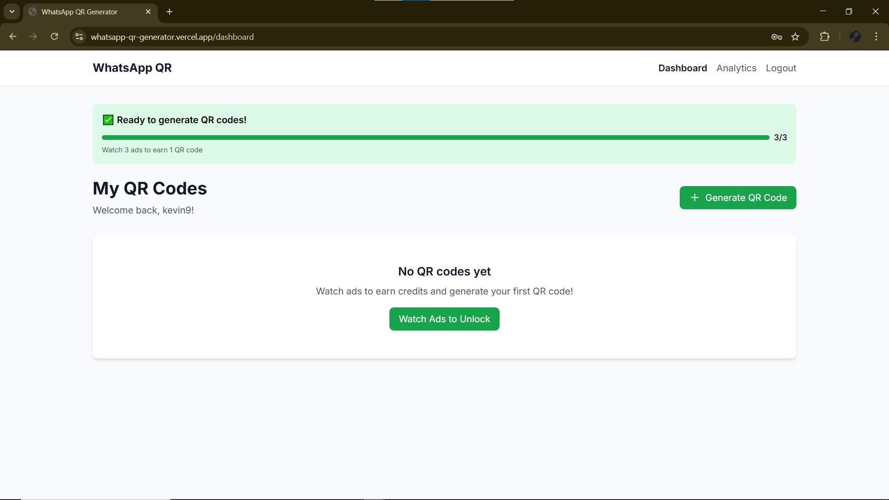
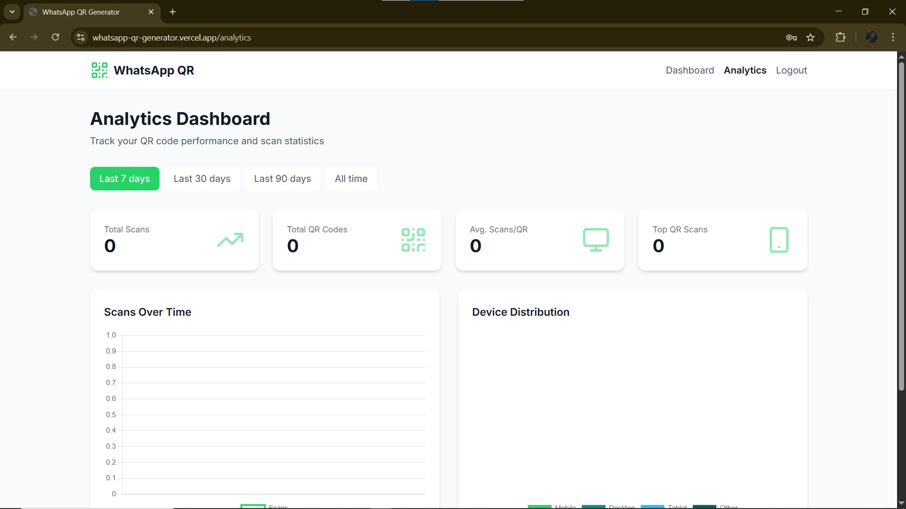
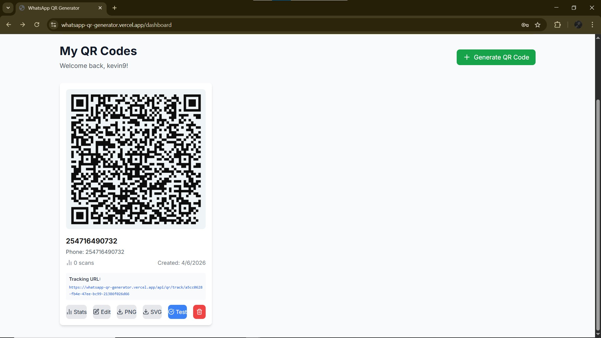

# 📱 WhatsApp QR Generator

## Create Beautiful WhatsApp QR Codes for Your Business

### Generate custom WhatsApp QR codes in seconds. Track scans. Grow your business.

---

## 📸 See It In Action

| Landing Page | Dashboard | QR Generator |
|--------------|-----------|--------------|
|  |  |  |

| Analytics | Download |
|-----------|----------|
|  |  |

---

## 🚀 What Can You Do?

### For Business Owners
- **Get customers instantly** - Let them WhatsApp you with one scan
- **Track every scan** - Know when and where people find you
- **Multiple campaigns** - Create QR codes for different products
- **No coding needed** - Simple, intuitive interface

### For Marketing Teams
- **Campaign tracking** - Measure which ads drive WhatsApp traffic
- **Custom branding** - Match QR colors to your brand
- **Download in HD** - PNG and SVG formats for print
- **Real-time analytics** - See results instantly

### For Everyone
- **100% Free** - Watch short ads to earn QR codes
- **No credit card required** - Just register and start
- **Works on any device** - Desktop, tablet, or phone
- **Secure** - Your data is protected

---

## 🎯 How It Works

### 1️⃣ Register for Free
Create your account in seconds. No payment required.

### 2️⃣ Watch Short Ads
Support the service by watching 3 short ads (5 seconds each). Earn credits to generate QR codes.

### 3️⃣ Generate Your QR Code
Enter your business name and WhatsApp number. Choose colors. Click generate.

### 4️⃣ Download & Share
Download as PNG or SVG. Print on flyers, menus, business cards, or share online.

### 5️⃣ Track Results
See how many people scan your QR code. View analytics to measure engagement.

---

## ✨ Features

### 🎨 Custom Design
- Choose any color for your QR code
- Match your brand identity
- Professional look for your business

### 📊 Smart Analytics
- Total scan count
- Daily scan trends
- Device breakdown (mobile vs desktop)
- Scan time analysis

### 🔄 Dynamic QR Codes
- Update your WhatsApp number anytime
- Keep the same QR code
- Never reprint again

### 💾 Multiple Formats
- Download as PNG for web use
- Download as SVG for print
- High resolution for any use case

### 💰 Ad-Powered Model
- **Free to use** - Watch 3 short ads per QR code
- **No subscription** - Pay with your time, not money
- **Fair system** - Every user gets equal access

### 🔒 Security
- Your data is private
- Secure login with JWT
- MongoDB Atlas cloud database

---

## 📊 Real Results

| Feature | What You Get |
|---------|--------------|
| QR Codes | Unlimited generation |
| Scan Tracking | Detailed analytics |
| Download Formats | PNG + SVG |
| Color Options | Full customization |
| Dynamic QR | Updateable links |
| Support | Free forever |

---

## 🌟 Why Choose WhatsApp QR Generator?

| Alternative | Our Solution |
|-------------|--------------|
| 💰 $10-50/month subscriptions | **FREE with ads** |
| 📊 No analytics | **Full scan tracking** |
| 🎨 Basic designs | **Custom colors** |
| 🔒 No dynamic QR | **Updateable links** |
| 📱 One format | **PNG + SVG** |

---

## 🚀 Ready to Get Started?

### Step 1: Visit [our website](https://whatsapp-qr-generator.vercel.app/)
### Step 2: Create your free account
### Step 3: Watch 3 short ads (earn your first QR code)
### Step 4: Generate your custom WhatsApp QR code
### Step 5: Start connecting with customers!

---

